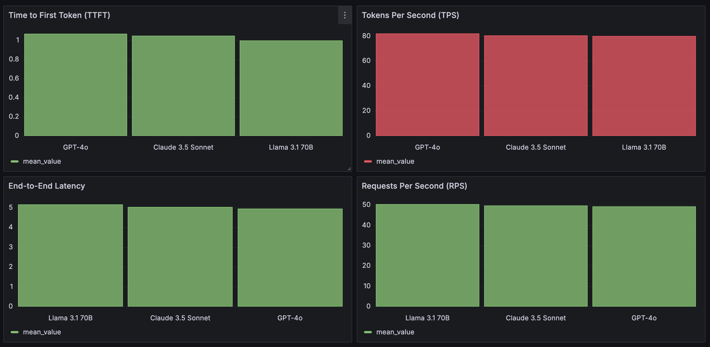

# LLM Benchmark Application

## Table of Contents
1. [Introduction](#introduction)
2. [Features](#features)
3. [Prerequisites](#prerequisites)
4. [Local Development Setup](#local-development-setup)
5. [Docker Compose Setup](#docker-compose-setup)
6. [Kubernetes Deployment](#kubernetes-deployment)
7. [Github Actions](#github-actions)
8. [Configuration](#configuration)
9. [Usage](#usage)
10. [Implementation Details](#implementation-details)
11. [Data Visualization](#data-visualization)
11. [Testing](#testing)
12. [Troubleshooting](#troubleshooting)

## Introduction

The LLM Benchmark application is designed to benchmark and simulate metrics for Large Language Models (LLMs). It consists of two main components: a metric benchmarking service and a metric simulation service. The application uses PostgreSQL for data storage and Redis for caching and message queuing.

## Features

- Simulates performance data for multiple LLMs
- Ranks LLMs based on various metrics
- Exposes rankings via an API endpoint
- Deployable as microservices in a Kubernetes cluster


## Prerequisites

- Python 3.12
- Postgres 17.0
- Redis
- Docker and Docker Compose
- Kubernetes cluster (for Kubernetes deployment)
- Helm 3+ (for Kubernetes deployment)

Prerequisites to run the application
1. Clone the repository and then create/update .env values file using .env.example:
   ```
   git clone https://github.com/kampkelly/llm-benchmark.git
   cd llm-benchmark
   cp .env.example .env
   ```

## Local Development Setup

##### Running the aplication
To start the application in a single command, run this:
```
make start
```

For a detailed breakdown, see the below steps:
1. Create a virtual environment and activate it:
   ```
   python -m venv venv
   source venv/bin/activate
   ```

2. Install dependencies:
   `make install`
<br>

3. Set up your `.env` file with the necessary environment variables:
   ```
   POSTGRES_USER=
   POSTGRES_HOST=localhost
   POSTGRES_PORT=5432
   POSTGRES_PASSWORD=postgres
   POSTGRES_DB=llm_benchmark
   API_KEY=1234
   SCHEDULE_INTERVAL=1
   REDIS_HOST=localhost
   REDIS_PORT=6379
   SEED=3
   ```

4. Run database migrations:
   `make run-migrations`
<br>
5. Start the services:
    Metric simulator: 

   `make start-simulator`

   Metric benchmark (In a separate terminal):

   `make start-benchmark`

## Docker Compose Setup

1. Ensure Docker and Docker Compose are installed on your system.

2. Build and start the services:
   ```
   docker-compose up --build
   ```

This will start the metric benchmark service, metric simulator service, PostgreSQL, and Redis.
You can the access the rankings api (more details below) on `http://localhost:8001/api/v1/benchmarks/rankings`


## Kubernetes Deployment

1. Ensure you have a Kubernetes cluster set up and `kubectl` configured to communicate with your cluster.

2. Install Helm if you haven't already:
   ```
   curl https://raw.githubusercontent.com/helm/helm/master/scripts/get-helm-3 | bash
   ```
  or `brew install helm`

3. Create/update .env file as described earlier
<br>


4. Run script to start
`./deploy.sh`
This updates dependencies, copies some needed environment variables and then installs helm using the environment variables

## Github Actions
Whenever you push changes to the main branch of this repository, the GitHub Actions workflow will automatically trigger build and deployment.
Ensure env variables are properly setup in repository secrets.
You can monitor the progress in the "Actions" tab of this GitHub repository.

## Configuration

The application can be configured using environment variables. The main configuration options are:

- `POSTGRES_USER`: PostgreSQL username
- `POSTGRES_HOST`: PostgreSQL host
- `POSTGRES_PORT`: PostgreSQL port
- `POSTGRES_PASSWORD`: PostgreSQL password
- `POSTGRES_DB`: PostgreSQL database name
- `API_KEY`: API key for authentication
- `SCHEDULE_INTERVAL`: Interval for scheduled tasks
- `REDIS_HOST`: Redis host
- `REDIS_PORT`: Redis port
- `SEED`: Seed for random number generation (optional)

## Usage

Once the application is running, you can interact with it using the provided APIs. The main endpoints are:

##### Metric Benchmark Rankings APIs: `http://localhost:8001`

Accessing any of these endpoints below requires an api-key sent in the request headers under `x-api-key`. The value of this api key can be set in the .env file. `API_KEY=1234`
##### Endpoints

- **GET** `/api/v1/benchmarks/rankings`

This API provides an endpoint to fetch the rankings of various Language Learning Models (LLMs) based on their benchmark results for all metrics. The rankings are calculated using simulation metrics such as Time to First Token (TTFT), Tokens Per Second (TPS), End-to-End Request Latency (e2e_latency), and Requests Per Second (RPS).

<br>

- **Response**
The response will be a JSON object containing the rankings of LLMs for all the metrics. The structure of the response is as follows (in descending ranking order):

```json
{
    "data": [
        {
            "ttft": [
                {
                    "llm_name": "GPT-4o",
                    "mean_value": 1.07
                },
                {
                    "llm_name": "Claude 3.5 Sonnet",
                    "mean_value": 1.05
                },
                ...
            ]
        },
        {
            "tps": [
                {
                    "llm_name": "GPT-4o",
                    "mean_value": 82.15
                },
                ...
            ]
        },
    ]
}
```

<br>

- **GET** `/api/v1/benchmarks/rankings/{metric_name}`
This API provides an endpoint to fetch the rankings of a metric of various Language Learning Models (LLMs) based on their benchmark results. The rankings are calculated using simulation metrics such as Time to First Token (TTFT), Tokens Per Second (TPS), End-to-End Request Latency (e2e_latency), and Requests Per Second (RPS).

- **Parameters**
where `metric_name` is one of `ttft`, `tps`, `e2e_latency`, `rps`
<br>
- **Response**
The response will be a JSON object containing the rankings of LLMs for the specified metric. The structure of the response is as follows (in descending ranking order):

```json
{
    "data": [
        {
            "ttft": [
                {
                    "llm_name": "GPT-4o",
                    "mean_value": 1.07
                },
                {
                    "llm_name": "Claude 3.5 Sonnet",
                    "mean_value": 1.05
                },
                {
                    "llm_name": "Claude 3.5 Sonnet",
                    "mean_value": 1.0
                }
            ]
        }
    ]
}
```

### Implementation Details
The metric simulation makes use of a randomizer which generates random values from a uniform distribution. It optionally makes use of a seed whose default seed value is 20. The response attained from this seed value (20) can be found in public/response.json file. To change the seed, please update the value in the .env file.

Some initial data for llms and metrics (not data points) are seeded into the database the first time the server boots up. This allows for easy testing and generation of data points for the metrics.

On calling the rankings and get rankings by metric name API, itakes approximately 60 - 80 milliseconds to return a response. The result is then cached for faster retrieval further reducing the latency to less than 20 milliseconds The expiry of this cache is controlled by the repeated job that regenerates the metrics and clears the cache every x minutes. To configure x minutes, update the `SCHEDULE_INTERVAL` in .env file.

##### Retries
This scheculed job has a retry functionality built into it such that it retries the requests up to `x` times with a `y` secs delay in-between where `x` and `y` are `MAX_RETRIES` (default is 2) and `RETRY_DELAY` (default is 60) respectively. They both can be configured from the .env file.
This retry is managed by redis and also implements a lock to ensure only one job is running at a time which is suitable for a distributed environment.

## Data Visualization
Grafana should already be installed and running after running `docker-compose up`.
Once Grafana is running, open it in your browser: [http://localhost:3000](http://localhost:3000)
1. Login to Grafana: Default login is username: admin, password: password or what was specified for password as `GF_SECURITY_ADMIN_PASSWORD` in .env file.
2. Install the Infinity datasource if it is not already installed and add as a Data source.
3. Create a new dashboard and click on "Import". Then input the json in public/LLM_Performance_Dashboard.json in the input box and load. Now you should be able to view the data as shown below from the rankings api.




## Testing
To run the tests:
`make tests`


## Troubleshooting

Common issues and their solutions:

1. Database connection errors:
   - Ensure PostgreSQL is running and accessible.
   - Check the `POSTGRES_*` environment variables.

2. Redis connection errors:
   - Ensure Redis is running and accessible.
   - Check the `REDIS_*` environment variables.
